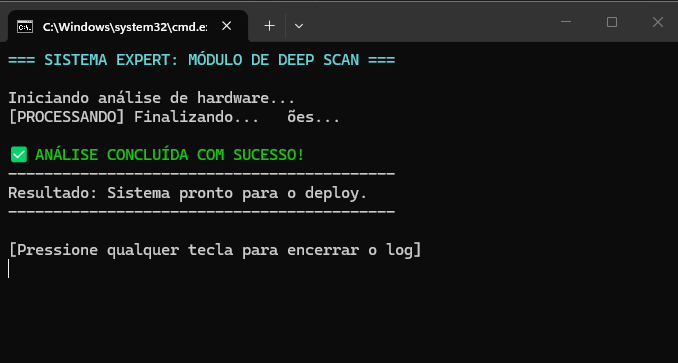

# Aplicação da-1ª Heurística de Nielsen.
o projeto demonstra a Heurística de Nielsen “Visibilidade do Status do Sistema”. Durante a execução, o programa informa cada etapa do processo em tempo real, utilizando atualização de linha, pausas para simular processamento e cores para destacar informações. Ao final, exibe uma mensagem clara de sucesso, garantindo que o usuário entenda o que aconteceu durante toda a execução.

## 📸 Evidência de Execução

